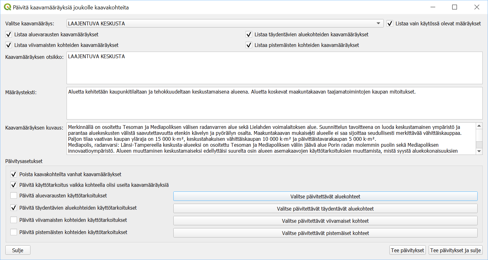
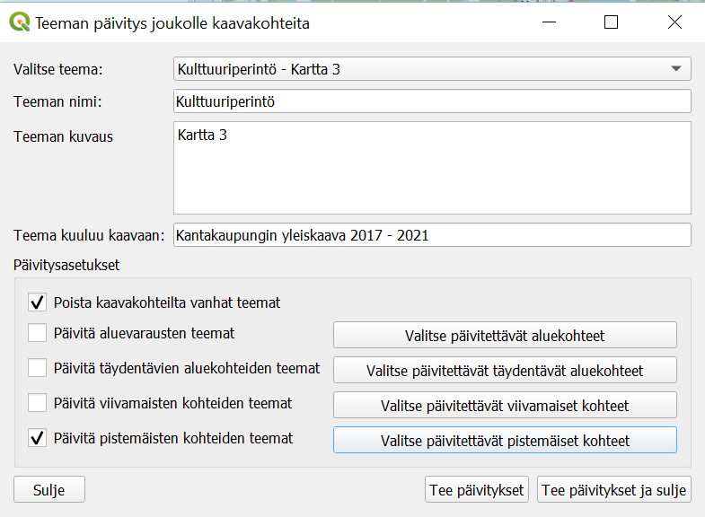
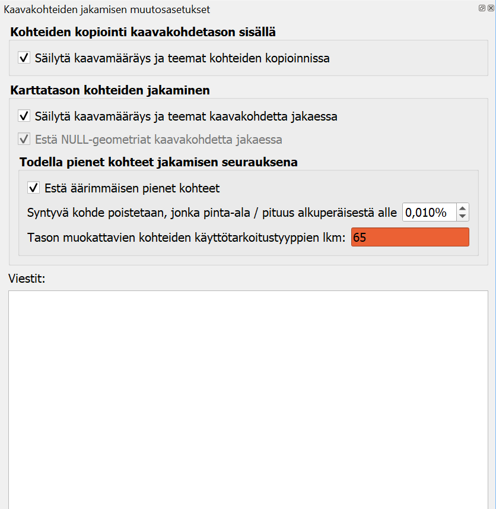
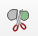
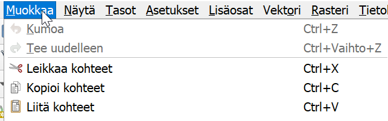
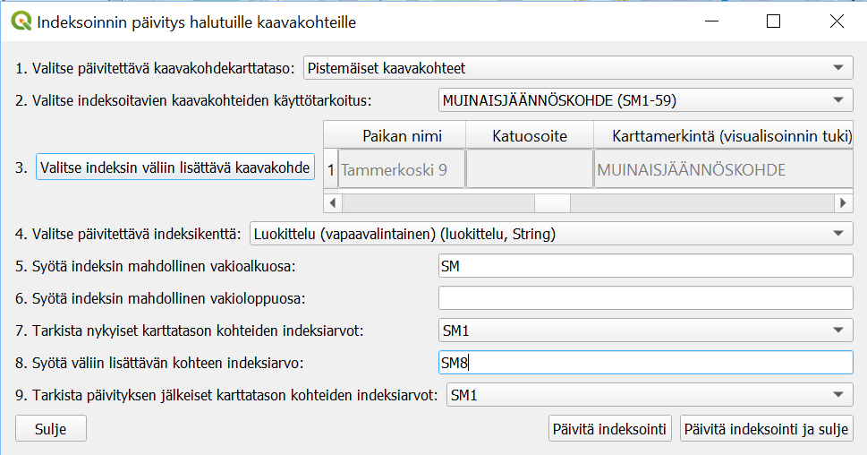

.. Yleiskaava documentation master file, created by
   sphinx-quickstart on Sun Feb 12 17:11:03 2012.
   You can adapt this file completely to your liking, but it should at least
   contain the root `toctree` directive.

Tervetuloa Yleiskaava-työkalun dokumentaatioon!
***********************************************

Tässä ohjeessa on kuvattu kunkin käyttöliittymästä löytyvä toiminto sillä tasolla, että sitä pitäisi pystyä ohjeen perusteella käyttämään. Kaikkea toimintojen osalta ei kuitenkaan varmasti ole huomattu dokumentoida. Joitakin yleisiä huomioita:

* Toimintojen tekemät muokkaukset kaavakohteille ja tietokantaan edellyttävät usein kohdekarttatasojen tallentamista. Esimerkiksi kaavamääräys- ja teema-relaatioiden lisääminen onnistuu uusille kaavakohteile vasta, kun uudet kaavakohteet on tallennettu tietokantaan. Tästä toiminnon tekememästä tallennuksesta seuraa se, että QGIS:n Muokkaa-valikon Kumoa-toiminnolla ei voi perua kaavatasolle tehtyjä muokkauksia toiminnon käyttämisen jälkeen.
* Koska työkalun toiminnot käyttävät suoraan QGIS-työtilan karttatasoja, niin työkalu olettaa, että työtilasta löytyy esim. kaavakohdekarttatasot nimillä "Aluevaraukset", "Täydentävät aluekohteet (osa-alueet)", "Viivamaiset kaavakohteet" ja "Pistemäiset kaavakohteet" sekä esim. taulut "kaavamääräykset" ja "kaavaobjekti_kaavamaarays_yhteys". Näitä työtilan mukana alunperin tulleita karttatasoja ei saa poistaa tai uudelleen nimetä. Työkalu ei toimi, jos näitä tasoja uudelleen nimeää tai poistaa. Työtilaan voi kyllä vapaasti lisätä uusia karttatasoja ja tehdä niille vapaasti haluamiaan käsittelyjä.
* Jotkin työkalun ominaisuudet toimivat hieman erilailla riippuen miten kaavakohdetasojen kohteita on suodatettu. Osa toiminnoista esim. listaa kaavakohteiden käyttötarkoitukset dialogissa, jolloin jos kaavakohdetasolla on suodatettu kohteita vaikkapa niin, että vain tietyn käyttötarkoituksen mukaiset kohteet on suodatettu karttatasolle, niin työkalu listaa vain tämän yhden käyttötarkoituksen.

.. toctree::
   :maxdepth: 2

Toiminnot
=========

* :ref:`Kopioi lähdeaineistoa tietokantaan`
* :ref:`Kaavamääräyksen päivitys joukolle kaavakohteita`
* :ref:`Teeman päivitys joukolle kaavakohteita`
* :ref:`Vaihda kenttien arvoja joukolle kaavakohteita`
* :ref:`Kaavakohteiden kopiointi ja geometrinen muokkaus`
* :ref:`Päivitä kaavakohteiden indeksointia`
* :ref:`Lisää linkkejä lähtöaineistoihin`
* :ref:`Asetukset`
* :ref:`Ohje`

Kopioi lähdeaineistoa tietokantaan
..................................

Kopiointi lähdekarttatasosta yleiskaavan tietokantaan onnistuu seuraavin vaihein:

#. Valitse lähdekarttataso sekä kohdekaavakohdetaulu ja kohdekentät haluamillesi lähdekarttatason kentille. Kun jätät lähdekenttää vastaavan kohdekentän arvon tyhjäksi, niin ko. lähdekentän arvoja ei kopioida kohdetauluun, mutta esim. kaavan nimi ja numero huomioidaan silti myöhemmin. Kun jätät kohdekentän valitsematta, niin sille ei kopioida lähdetaulusta arvoa, mutta voit myöhemmin halutessasi asettaa sille joka tapauksessa oletusarvon. Jos haluat yhdistää useamman lähdekentän samaan kohdekenttään, niin se on mahdollista, jos kenttien tyypit ovat yhteensopivia. Klikkaa Seuraava-painiketta, kun olet asettanut haluamillesi lähdekarttatason kentille kohdetaulun kentän.
  
   .. figure:: images/kopiointi_d1.png

#. Valitse lähdekarttatason attribuuttitaulusta tietokantaan kopioitavat kohteet ja klikkaa sitten Seuraava-painiketta. Voit halutessasi sulkea lähdekarttatason attribuuttitaulun valittuasi kopioitavat kohteet.

   .. figure:: images/kopiointi_d2.png

#. Valitse tarvittaessa oletusarvot pakollisille kohdetaulujen kentille ja mahdollisesti muita kopiointiasetuksia, kuten tehdäänkö kaavamääräysotsikkoa vastaava kaavamääräys, jos sitä ei jo ole. Klikkaa Aja-painiketta aloittaaksesi lähdekarttatason kohteiden kopioinnin yleiskaavan tietokantaan.
  
   .. figure:: images/kopiointi_d3.png

#. Jos aineistoa on paljon, niin näet avautuvasta dialogista kopioinnin edistymisen. Kun kopiointi on valmis, niin tästä annetaan ilmoitus.

Lähdeaineiston koordinaattijärjestelmä voi erota tietokannan koordinaattijärjestelmästä. Työkalu tekee tarvittaessa automaattisen muunnoksen.

.. Voit halutessasi tarkistaa ajamisen seurauksena tehtävän kopion aiheuttamat muutokset tietokantaan "Näytä ajolla tehtävät muutokset"-painikkeella.

Kaavamääräyksen päivitys joukolle kaavakohteita
................................................

Tällä ominaisuudella käyttäjä voi päivittää kaavamääräyksen kerralla halutulle joukolle kaavakohteita.

Kaavamääräys, joka kohteille päivitetään valitaan "Valitse kaavamääräys"-kohdasta. Myös kaavamääräyksen otsikon, tekstin ja kuvauksen voi päivittää tämän dialogin kautta.

Asetuksella "Poista kaavakohteilta vanhat kaavamääräykset" poistetaan valituilla kaavakohteilla jo olevat kaavamääräykset. Käyttäjä valitsee päivitettävät kaavakohteet "Valitse päivitettävät aluekohteet"-, "Valitse päivitettävät täydentävät aluekohteet"-, "Valitse päivitettävät viivamaiset kohteet"- ja "Valitse päivitettävät pistemäiset kohteet"-painikkeiden kautta avatuvien karttatasojen attribuuttitaulujen kautta. Käyttäjä voi myös valita kohteet jo ennen "Kaavamääräyksen päivitys joukolle kaavakohteita"-dialogin avaamista, mutta ko. kohteiden valinta pitää varmistaa avaamalla haluamansa karttatasojen attribuuttitailut em. mainituilla painikkeilla ennen "Tee päivitykset"-painikkeen painamista.

Jos kaavakohteille on asetettu yleiskaava ja yleiskaavalle numero, niin käyttötarkoituksen lyhenne koitetaan huomioida aluevarausten kaavamääräysten päivityksessä.

Teknisesti ei ole aina mahdollista visualisoida kaavakohteita suoraan kaavamääräys-taulun kaavamääräyksen perusteella ainakin siksi, että kaavakohteeseen voi liittyä useita kaavamääräyksiä ja siksi QGIS-työtilassa kaavakohteiden visualisointityyli on valittu kaavakohde-taulujen kayttotarkoitus_lyhenne-kentän perusteella, johon muiden kuin käyttötarkoitusalueiden tapauksessa, on tallennettu lyhenteen sijaan kaavamääräys-taulussa olevan kaavakohteeseen liittyvän kaavamääräyksen otsikko. Jos kaavakohteeseen liittyy useita kaavamääräyksiä, niin käyttäjä voi "Päivitä käyttötarkoitus vaikka kohteella olisi useita kaavamääräyksiä"-asetuksella valita miten tässä tilanteessa toimitaan. Kaavakohteiden käyttötarkoituksen (kenttä kayttotarkoitus_lyhenne) arvo päivitetään myös (ja samalla päivitetään kaavakohteiden kaavamaaraysotsikko-kentän arvo), kun "Päivitä käyttötarkoitus vaikka kohteella olisi useita kaavamääräyksiä"-asetus on valittu, vaikka kohteella olisi useita kaavamääräyksiä päivityksen jälkeen. Jos ko. asetus ei ole käytössä, niin valittu kaavamääräys lisätään kohteelle, mutta käyttötarkoitukseen ei tehdä muutoksia, jos kohteella on useita kaavamääräyksiä päivityksen jälkeen. Jos kuitenkin asetus "Poista kaavakohteilta vanhat kaavamääräykset" on käytössä, niin "Päivitä käyttötarkoitus vaikka kohteella olisi useita kaavamääräyksiä"-asetuksella ei ole vaikutusta.

Jos et valitse kaavamääräystä ja jätät "Poista kaavakohteilta vanhat kaavamääräykset"-asetuksen valituksi, niin valitsemiltasi kaavakohteilta poistetaan kaavamääräykset, mutta ei lisätä uusia. Jos myös asetus "Päivitä käyttötarkoitus vaikka kohteella olisi useita kaavamääräyksiä" on valittu, niin myös käyttötarkoituksen (kenttä kayttotarkoitus_lyhenne) arvo poistetaan myös (ja samalla poistetaan myös kaavakohteiden kaavamaaraysotsikko-kentän arvo).

Teeman päivitys joukolle kaavakohteita
......................................

Teeman päivitys tapahtuu hyvin samaan tapaan kuin kaavamääräyksen, mutta asetuksia on hieman vähemmän.

Kuten kaavamääräyksen päivtyksen tapauksessa, niin teemankin tapauksessa, päivityksen voi halutesaan tehdä kerralla aluevarauksille, täydentäville aluekohteille, viiva- ja pistekohteille. Päivitys ei kohdetyypille tapahdu ennen kuin on avannut "Valitse ..."-painikkeella attribuuttitaulun. "Valitse ..."-painiketta painaessa myös painikkeen vieressä oleva "Päivitä ..."-valintaruutu valitaan automaattisesti.

Vaihda kenttien arvoja joukolle kaavakohteita
.............................................

Tällä toiminnolla voi vaihtaa kerralla joukolle haluamiaan kaavakohteita ominaisuustietojen arvoja.

#. Valitse ensiksi kohteet, joiden tietoja päivitetään "Valitse päivitettävät ..."-painikkeella.

   .. figure:: images/vaihda_ominaisuustietoja_d1.png

#. Kohteiden valinnan jälkeen "Valitse päivitykset ..."-painikkeella avaa dialogi, jossa voit valita päivitettävät kentät ja niille asetettavat arvot. Päivitykset valituille kohteille tehdään, kun klikkaat "Päivitä arvot valituille kohteille"-painiketta.

   .. figure:: images/vaihda_ominaisuustietoja_d2.png

Kaavakohteiden kopiointi ja geometrinen muokkaus
................................................

Kaavakohteiden (aluevaraukset, täydentävät aluekohteet ja viivamaiset kaavakohteet -karttatasot) geometrisessa jakamisessa saat kaavamääräykset ja teemat säilymään kaikilla jaetuilla kohteilla, kun avaat tämän toiminnon paneelin. Myös kaavakohdetason sisällä tapahtuva kohteiden kopionti ja liittäminen säilyttää halutessa kaavamääräys- ja teema-relaatiot, kun tämän toiminnon paneeli on avattuna.

Kaavakohteiden geometrinen jakaminen
------------------------------------

"Jaa kohteet"-painikkeella (|splitfeatures|) voit halutessasi jakaa kaavakohteita kuten normaalisti. Yleiskaava-työkalu havaitsee kohten jakamisen ja lisää jaon seurauksena syntyneelle uudelle kohteelle kaavamääräyksen ja teeman. Kaavamääräysten ja teeman automaattinen lisääminen edellyttää, että "Jaa kohteet"-toiminto on valittu vasta "Kaavakohteiden kopiointi ja geometrinen muokkaus"-toiminnon paneelinen avaamisen jälkeen.

Huomaa, että tasolla on hyvä suodattaa kohteet esim. tietyn käyttötarkoituksen mukaan ennen jakamista, koska kaavamääräyksen ja teeman säilyminen jakamisessa ei luultavasti onnistu, kun tasolla on vaikka tyylin kautta piilotettujakin, kaavakohteita samassa kohtaa, jossa jako tehdään. QGIS siis jakaa "Jaa kohteet"-painikkeella myös karttasolla piilossa olevat kohteet, jos niitä ei ole suodatettu pois. Tämän vuoksi paneelissa on kohta "Tason muokattavien kohteiden käyttötarkoitustyyppien lkm", joka varoittaa mahdollisesti piilossa olevista kaavakohteista, joihin jako saattaa vaikuttaa.

Kaavakohteiden kopiointi ja liittäminen kaavakohdetasolla
---------------------------------------------------------

Kun valintaruutu "Säilytä kaavamääräys ja teemat kohteiden kopioinnissa" on aktivoitu, niin silloin myös kaavakohdetason sisäinen kohteiden kopionti (tai leikkaus) ja liittäminen säilyttävät kaavamääräykset ja teemat.

Päivitä kaavakohteiden indeksointia
...................................

Tietyillä kaavakohteilla kuten muinaisjäännöskohteilla ja kemikaalilaitosten konsultointivyöhykkeillä on usein indeksointi. Tämän toiminnon avulla on mahdollista lisätä jo indeksoitujen kohteiden väliin uusi kaavakohde ja päivittää sen jälkeen seuraavien kohteiden indeksointia.

Edellä kuvassa on esitetty mahdollinen päivitystilanne, jossa muinaisjäännöskohteiden väliin halutaan lisätä kohteelle indeksi SM8 ja kasvattaa sen jälkeisten kohteiden indeksointeja.

Tällä hetkellä indeksointi toimii aakkosilla (a, b, c, ...) sekä kokonaisluvuilla (1, 2, 3, ...). Indeksoinnin ei tarvitse tosin alkaa a-kirjaimesta tai 1:stä. Lisäksi indeksissä voi olla vakioalku- ja/tai loppuosa. Esimerkissä on kokonaislukuindeksointi ja indeksissä vakioalkuosa SM.

Lisää linkkejä lähtöaineistoihin
................................

Lähtöaineistolinkkien lisääminen on tällä hetkellä mahdollista vain Siiri-rajapinnalta.

.. figure:: images/linkit_d.png

Kun toiminnon dialogissa on valinnut kaavakohteen, jolle halutaan lisätä lähdetietoja sekä lähderajapinnan ja lähdetason, jolta tietoja haetaan, niin haetaan määritellyltä etäisyydeltä kaavakohteesta sijaitsevat lähdeaineiston kohteet. Halutun kohteen voi yhdistää eli lisätä lähtöaineistolinkin kaavakohteelle. Lisäksi kunkin lähtöaineistokohteen osalta on mahdollista katsoa sen tarkempia tietoja sekä infoikkunasta, että lähdetietosivulta. Voit myös katsoa mahdollisesti jo johonkin lähtöaineistokohteeseen yhdistetyn kaavakohteen tiedot.

Asetukset
.........

Asetukset-dialogissa on tällä hetkellä vain asetus, jolla voi valita pidetäänkö toimintoihin liittyvät dialogit päälimmäisinä vai ei.

Ohje
....

Ohje-toiminnosta aukeaa tämä ohje.

.. Indices and tables
.. ==================

.. * :ref:`genindex`
.. * :ref:`modindex`
.. * :ref:`search`

